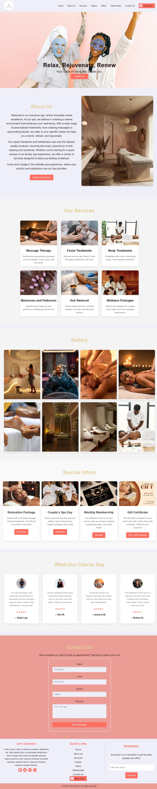

# Calm Haven Spa Landing Page Template

This is a responsive landing page template for **Calm Haven Spa**, designed to provide users with a seamless and enjoyable experience when exploring spa services. Created with **HTML**, **CSS**, and **JavaScript**, this template highlights the spa's offerings, gallery, and customer testimonials, with a strong focus on usability and visual appeal.



---

## Table of Contents

- [Overview](#overview)
- [Features](#features)
- [Installation](#installation)
- [Usage](#usage)
- [File Structure](#file-structure)
- [Customization](#customization)
- [License](#license)
- [Contact](#contact)

---

## Overview

**Calm Haven Spa** is a template ideal for spas, wellness centers, and beauty services. The landing page layout includes sections for the spa's services, an engaging gallery, special offers, testimonials, and a contact form for booking and inquiries. The **Book Now** button in the navigation bar provides quick access to connect with the owner via WhatsApp, ensuring direct communication for bookings or further inquiries.

---

## Features

- **Responsive Design**: Adapts smoothly to various screen sizes, including mobile, tablet, and desktop.
- **Book Now Button**: The navigation bar includes a **Book Now** button that opens WhatsApp, allowing users to chat directly with the spa owner for easy booking and inquiries.
- **Sections Included**:
  - **About Us**: Brief introduction about Calm Haven's mission and spa ambiance.
  - **Our Services**: Overview of various services such as massages theraphy, facial treatments, body treatments, Manicures/Pedicures,Hair removal,and wellness packages.
  - **Gallery**: Visual showcase of the spa's atmosphere, elegant rooms and rejuvenating treatments.
  - **Special Offers**: Highlighted packages, discounts,Gift certification and membership options.
  - **Testimonials**: Feedback from satisfied clients.
  - **Contact Form**: Section for users to submit questions or schedule an appointment.
- **Social Media Links**: Quick access to the spa's social media profiles for broader engagement.
- **Footer Links**: Provides navigation to key sections like About Us, Services, and more.
- **Newsletter**: 
---

## Installation

1. **Clone the Repository**

   ```bash
   git clone https://github.com/GraceO7/calm-haven-landing-page.git
   cd calm-haven-landing-page
   Open the Project

2. Open the index.html file in your preferred web browser to view the template.

## Usage
To set up this template on your own server or make modifications:

**Update Contact Details:**

Replace the WhatsApp number linked to the Book Now button in the navigation bar with the spa's or owner's number.
Modify the email address in the contact form to direct inquiries to the appropriate recipient.

**Edit Content:**

All text content, images, and links can be customized directly in the HTML file or replaced in the /images folder as needed.
**Customization:**

Modify the CSS file  to adjust colors, fonts, and layout according to your branding.

## File Structure
**plain text**
calm-haven-landing-page
├── index.html               # Main HTML file
├── images                   # Folder containing all website images
├── styles.css               # Main stylesheet
├── scripts.js               # JavaScript file
├── README.md                # Project documentation
└── LICENSE                  # License file for open-source contributions
            

## Customization
This template is designed to be easily customizable. Here are a few suggestions:

**Logo and Favicon**: Replace the existing logo and favicon in the public/images folder.
**Colors and Fonts**: Edit the colors and fonts in styles.css to match your brand identity.
**Services and Offers**: Update the content in the Our Services and Special Offers sections to reflect your spa's actual services and promotional offers.
**WhatsApp Link:** Ensure the href attribute in the Book Now button points to the correct WhatsApp URL format, replacing 1234567890 with the actual number:
**html**
<a href="https://wa.me/1234567890" target="_blank" class="btn-book-now">Book Now</a>

## License
This project is licensed under the MIT License. See the LICENSE file for more details.

## Contact
For any questions, feedback, or suggestions, feel free to reach out:

Email: ojeyemiopeyemi07@gmail.com
Website: Calm Haven
WhatsApp: Accessible via the Book Now button in the navigation bar.
Thank you for choosing Calm Haven Spa! We hope this template helps you create a calming and inviting online presence for your spa or wellness center.

**yaml**

This **README.md** provides clear instructions on using and customizing the template. Let me know if you'd like further adjustments or additions!

---

This version has enhanced formatting, consistent heading levels, and some small grammar and layout tweaks for clarity. Feel free to replace placeholder values like "1234567890" and add any further customization details as needed!
